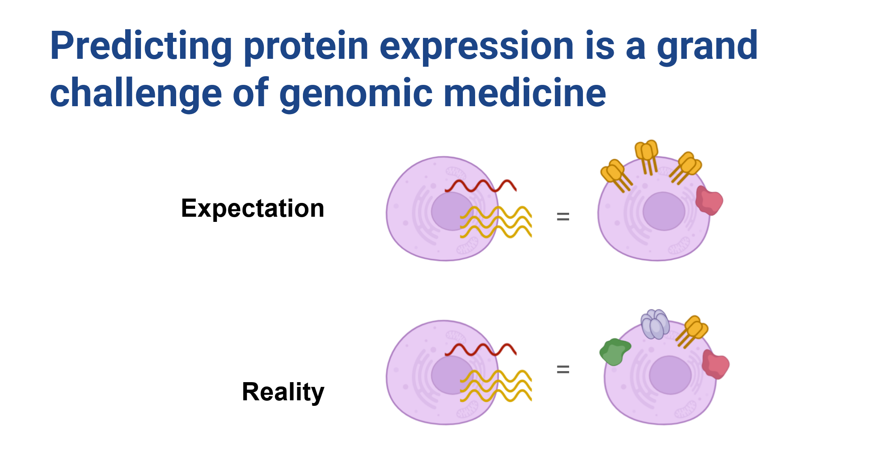
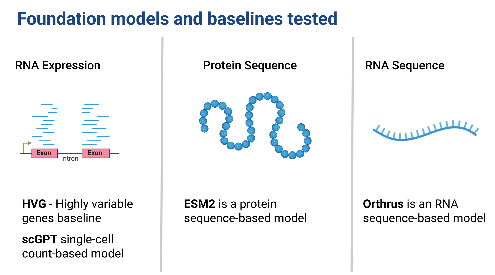
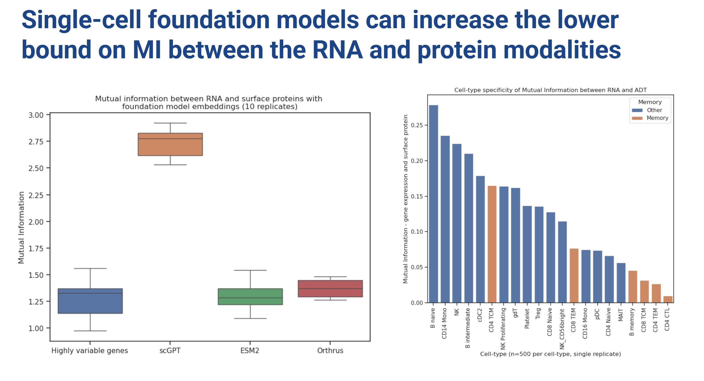
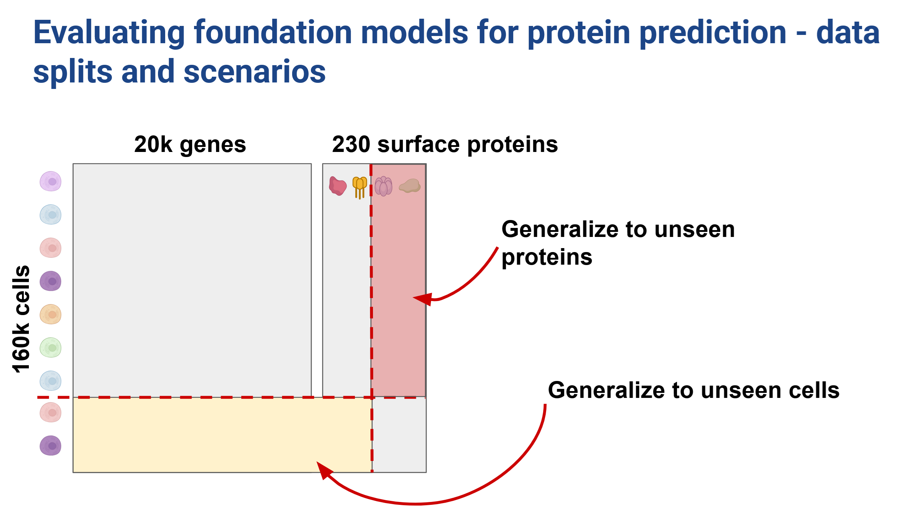
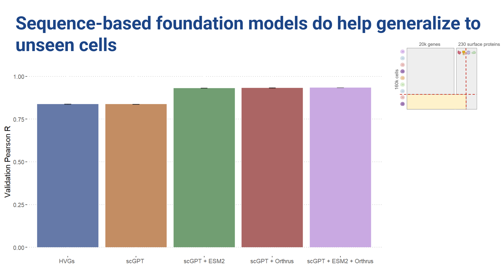
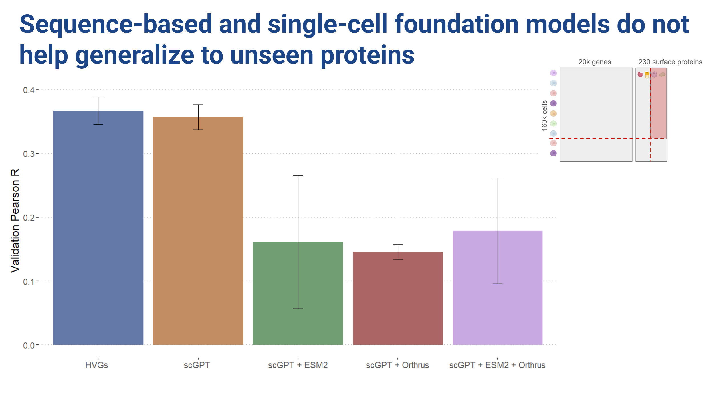
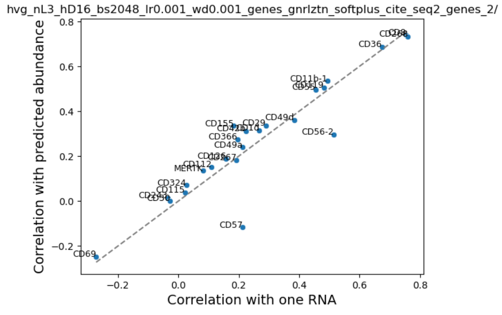
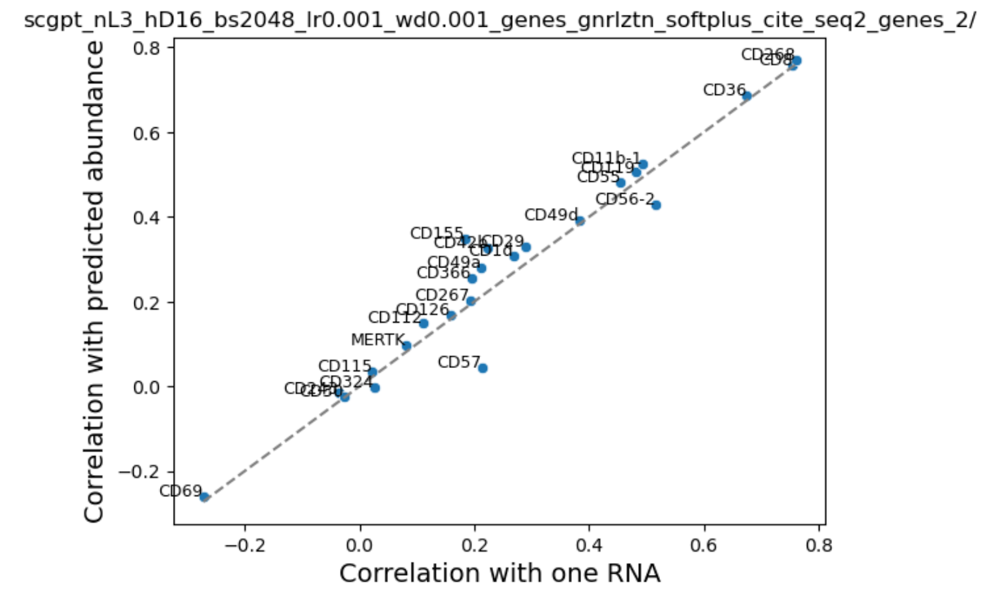
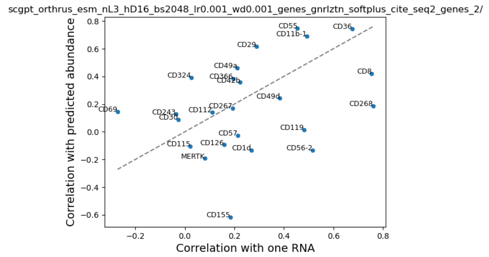

Gigantic thanks to [Phil Fradkin](https://philechka.com/) & [Hassaan Maan](https://hmaan.ca/) for their help putting together this post, and work on this project as a whole 😁. Here we'll describe our submission to Toronto bioinformatics Hackathon 2024, which was awarded the runner up prize 🥈

Find the project on github: [https://github.com/hackbio-ca/cite-seq-foundation-model-evaluation](https://github.com/hackbio-ca/cite-seq-foundation-model-evaluation)

# Introduction

Protein abundance is well known to be weakly correlated with RNA expression for most genes [@buccitelli_mrnas_2020], and remains an important outstanding problem in the field of predictive molecular biology. Specifically, cell surface proteins appear to be under tight control, and tend to vary by cell type. Here we focused on a project which revolves around a unique and powerful dataset generated by CITE-seq experiments. These experiments simultaneously measure both RNA-seq and cell surface protein abundance in the same cell, providing us with a comprehensive view of cellular activity (@fig-citeseq). The dataset is impressive in scale, encompassing measurements for approximately 20,000 genes and 200 proteins across 160,000 cells. We had a clear vision:

**Improve protein expression prediction from RNA by conditioning on representations of both cell state and the corresponding RNA sequence**

We know that processes controlling protein expression are in large part governed by sequence, such as mean ribosome loading, RNA half-life, and protein localization [@lin_evolutionary-scale_2023;@fradkin_splicing_2023], and given that modern foundation models’ ability to predict these attributes, we anticipated that it would be straightforward to improve over a relatively unsophisticated baseline of defining cell-state with highly variable genes (HVG). 

# Dataset

:::{}
](citeseq.png){#fig-citeseq fig-alt="Title: CITE-seq data makes it possible to compare models for both sequence and expression"}
:::

Cite-seq experiments from Stuart et al. [@hicks_missing_2018] provided a rich dataset that allowed us to explore the relationship between RNA expression and surface protein abundance at an unprecedented level of detail. However, it also comes with its own set of challenges, including the challenges related to sparsity of single-cell data [@hicks_missing_2018], as well as complexities specific to cell surface protein abundance measurements such as background antibody binding and technical effects due to factors like cell size [@stuart_comprehensive_2019; @mule_normalizing_2022].

One of the challenges that we encountered is that there isn’t a trivial mapping between antibody used for protein pull down and individual protein sequences. Some proteins had multiple antibodies and certain antibodies pulled down whole complexes of protiens, making a 1:1 mapping challenging. We believe that some of the challenges that we encountered in predictive modeling are due to this complexity.

One of the most notable aspects of this data is that the RNA-seq expression of a transcript doesn't strongly correspond to the abundance of the protein on the cell surface (@fig-rna_protein). We expect that this discrepancy arises as a result of a variety of cellular processes including how cell surface proteins are regulated, and the complex dynamics of RNA and protein lifecycles within the cell. Our expectation was that by conditioning model predictions on sequence we could learn the rules governing some of these factors and improve predictive capacity.

:::{}
{#fig-rna_protein fig-alt="Title: predicting protein expression is a grand challenge of genomic medicine. Shows a playful diagram showing expectation, a cell with similar transcripts and surface protein abundance vs reality, a cell with the same transcription, but a mix of all sorts of proteins present"}
:::

Taking a step back,this dataset provides an excellent opportunity to test both RNA and protein sequence models (@fig-central_dogma), allowing us to evaluate how well they can capture the properties of these biomolecules. We can compare performance, and are able to evaluate cell embedding models like scGPT [@cui_scgpt_2024] against a baseline of highly variable genes. This is a really cool setting\! In addition we’re able to take embeddings for RNA sequences and protein sequences and are able to compare not only within modality representational capability but also ask questions like: does addition of UTR sequences improve our predictive capacity?As far as we know, no one has been able to directly compare the utility of FMs trained for different modalities in this way before.

:::{}
{#fig-central_dogma fig-alt="Title: foundation models and baselines tested. Three parts are shown. 1) RNA expression with RNA pileup. HVG: highly variable gene baseline. scGPT: single-cell count-based model. 2) Protein sequence with string of amino acids. ESM2 is a protein sequence-based model. 3) RNA sequence with a string of RNA nucleotides. Orthrus is a RNA sequence-based model."}
:::

To recap: our hypotheses were twofold:

1. Embeddings from single cell foundation models can help in generalizing protein surface predictions to unseen cells.  
2. Using a combination of sequence-based and single-cell foundation models, we can generalize to cell surface protein expression for previously unseen proteins and cells.

Given that sequence foundation models have been useful for predicting physical properties of RNA and proteins e.g., expression level, half-life, mean ribosome load, structure, localization, we anticipated these embeddings will encode some informative protein properties. Additionally, we anticipated that cell embeddings would contribute valuable information about cell type and state, both of which may influence cell surface proteins.

Assuming cell surface abundance is some function of these physical properties and cellular context, we expected to see enhanced predictive power and generalization to unseen cell contexts and proteins by leveraging these comprehensive embeddings.

# Exploring mutual information of embeddings and cell surface protein abundance

:::{}
{#fig-MI fig-alt="Title:Single-cell foundation models can increase the lower bound on MI between the RNA and protein modalities. Boxplot shows HVG and ESM2 with similarly low mutual information around 1.25, Orthrus slightly higher at 1.4 and scGPT much higher at 2.75 MI. Barplot shows different cell types, with four memory cell types ranking lowest out of 21 cell types"}
:::

To start, we looked at the mutual information of embeddings with the target  protein expression using LMI [@gowri_approximating_2024], a new cool method for approximating mutual information between embeddings in high dimensions. 

scGPT clearly showed higher mutual information compared to an HVG baseline. Based on these findings, in all the subsequent reported experiments we decided to combine sequence embeddings with scGPT (@fig-MI). 

We also investigated MI of sequence based models with protein expression (combined with HVG via dot product scaling) which showed no major improvement in MI relative to the HVG baseline. One thing that remained on our minds is that if felt like there was no natural way to combine sequence model embeddings along with HVG baselines. The dot product is a somewhat ad-hoc way to do this, so take these results with a grain of salt (we certainly did).

By the way, there appears to be a cell-type-specific effect to the informativeness (MI) of RNA expression with cell surface protein abundance.

# On to the modelling

We tested two data splitting strategies to investigate our ability to generalize across both unseen cells and unseen proteins. We used a 70:15:15 split in the cell direction (@fig-unseen-cells) and a 60:10:30 train:val:test split in the protein direction (@fig-unseen-protein).

:::{}
{#fig-splits fig-alt="Title: Evaluating foundation models for protein prediction - data splits and scenarios. Matrix of 160k cells x 20k genes and 160k cells x 230 surface proteins. Data splits shown to generalize to unseen proteins and to unseen cells"}
:::

In a predictive setting we found that the cell embeddings did not provide improvements over the highly variable genes baseline. However, sequence embeddings improved prediction when generalizing to unseen cells. 

:::{}
{#fig-unseen-cells fig-alt="Title: sequence-based foundation models do help generalize to unseen cells. Barplot of validation pearsons R. HVGs and scGPT have similar value around 0.8, scGPT+ESM2, scGPT+Orthrus, scGPT+ESM2+Orthrus have similar value around 0.9"}
:::

When we hold out proteins however, training with the sequence embeddings hurt performance\!

:::{}
{#fig-unseen-protein fig-alt="Title: sequence-based foundation models do not help generalize to unseen proteins. Barplot of validation pearsons R. HVGs and scGPT have similar value around 0.37, scGPT+ESM2, scGPT+Orthrus, scGPT+ESM2+Orthrus have similar mean value around 0.15. Bars with EMS2 have larger error than the rest, ranging from 0.05 to 0.25"}
:::

Looking at the loss curves, we observed that the cell embedding models showed very little change in loss over the course of training. The sequence embedding models did seem to learn something, but we essentially ended up with a lot of overfitting (@fig-loss-curves).

:::{}
{#fig-loss-curves fig-alt="Training and validation loss curves. Training  loss decreases and plateaus over 5k training steps while validation loss remains flat. Barplots of validation loss, spearmanr, pearsonr all show scGPT + ESM as best performing model on average, although error bars are large and the difference between all models is relatively small"}
:::

# Litmus test

To investigate further, we looked at the correlation between our predicted and true protein expression values across cells and compared that with the naive baseline of RNA \- protein expression correlation. If we are unable to improve over native RNA-protein correlation then that means that addition of extra information is irrelevant for this problem.

We were surprised to find that addition of cell state in the form of scGPT embeddings or HVGS showed a very small boost in performance. We noted that performance varied by cell type and surface protein, probably reflecting differences in average abundance. Consistent with our training loss curves, addition of sequence embeddings performed inconsistently \- some proteins were better, while others performed worse. 

:::{#fig-corr layout-ncol=3}

{fig-alt="Scatter plot of approximately 25 genes, all are close to the x=y line and most are slightly above it, indicating correlation of predictions is generally slightly better than correlation with raw expression. CD57 and CD56-2 are possible exceptions falling below the x=y line."}

{fig-alt="Same style plot, most genes are close to or above the x=y line, with CD57 as possible exception."}

{fig-alt="Same style scatterplot, most genes are not very close to the x=y line, about half are above and half are below, indicating correlation of true abundance with predicted abundance is better than with raw expression for some genes, but not others."}

Correlation of true protein abundance with prediction vs correlation with expression (click to zoom)
:::

Despite these challenges, we did make some important discoveries:

* We explored a dataset with which it’s possible to benchmark foundation models across three modalities jointly: RNA expression, RNA sequence, and protein sequence  
* Foundation models embeddings can statistically significantly increase mutual information between surface protein expression and RNA expression. There may be other ways to combine these to improve prediction.

In conclusion, while our results weren't as promising as we initially hoped, they highlight an important opportunity for researchers to design more generalizable and data-efficient models for this challenging task. 

There was debate in the group regarding the negative results (@fig-disagree). Some of us were of the opinion that this is not the right data to test capabilities of these models due to the signal-to-noise ratio and inherent complexity of generating this data [@mule_normalizing_2022; @yin_characterization_2024] while others were left with the impression that the current generation of models is not quite there yet. Lastly, it may be that the processes between RNA expression and surface protein abundance are much more complex than the task dictates, and that no matter how good an RNA or protein foundation model is, they cannot capture the intricacies because of the data they were trained on. This isn't a limitation of the models, it's a limitation of the data. 

:::{}
{#fig-disagree fig-alt="Cartoon of three people. One looks argumentative and says the model is bad! One looks argumentative and says the data is bad! One looks unphased and says biology is complicated..."}
:::

# Conclusions

This continues to be a challenging, open problem! Maybe FMs still have some way to go before their embeddings are immediately useful out of the box (at least in a MLP probe set up). Or it’s possible that measuring cell surface protein expression is technically challenging and isn’t a great setting for predictive evaluation. Either way this is an important direction since predicting protein expression from sequence and cheaper experimental modalities such as RNA seq is clearly an important medical and biological frontier.

The set up itself is unique because of how we compared FMs trained for different modalities: sequence and RNA-expression level. This is no small feat! Looking forward, this project highlights an important aspect: carefully setting up the experiments. It’s critical that we did the protein-holdout exercise in addition, because otherwise the performance improvement contributed by the sequence models would likely have been inflated\! ”Navigating the pitfalls of applying machine learning in genomic” from Whalen et al. [@whalen_navigating_2022] continues to stand the test of time as a must read to ML + Bio practitioners. 
