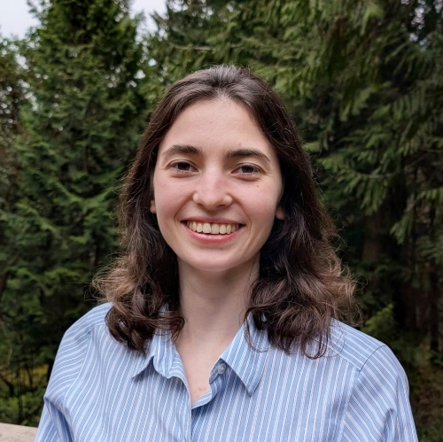

::: {.aside .center}
# Cait Harrigan

<a href="mailto:caitlin_harrigan(at)hms.harvard.edu" class="ul" role="button" aria-label="email"><i class="fa-solid fa-envelope"></i> Email me</a>

<a href="https://scholar.google.ca/citations?user=l4ElMEgAAAAJ&hl" class="ul" role="button" aria-label="google scholar"><i class="ai ai-google-scholar ai-xl"></i> Scholar</a>

<a href="https://orcid.org/0000-0002-9243-9648" class="ul" role="button" aria-label="orcid"><i class="ai ai-orcid ai-xl"></i> ORCID</a>

<a href="https://github.com/harrig12" class="ul" role="button" aria-label="github"><i class="fa-brands fa-github"></i> GitHub</a>
:::

I am a postdoctoral researcher in the [Park lab](https://compbio.hms.harvard.edu/) at Harvard Medical School. I use machine learning to study cancer evolution, and the selective forces that shape disease development.

I earned my PhD in Computer Science from the University of Toronto in 2026, supervised by [Quaid Morris](https://www.morrislab.ca/) and [Kieran Campbell](https://www.camlab.ca/). In my thesis, I developed probabilistic models and Bayesian optimization approaches to study DNA repair deficiencies in cancer. Previously, I completed my undergraduate studies at the University of Toronto in Computational Biology and Statistics.

I'm passionate about open science, and promoting great mentorship in the sciences. 

:::{.column-screen .hl-column}

::: {.column-margin}
:::

# Office Hours

As part of my ongoing commitment to supporting students at all levels and background in engaging with ML and computational biology, I make an effort to be available to provide mentorship, guidance, and resources. 

I set aside ~2h/month for by-request 30 minute meetings, which you can [book online](https://calendar.notion.so/meet/charrigan/office-hours), or reach out to me by email to arrange times outside of those listed. 

# News

* Mar 2026: PhDone 🎓 
* Jul 2025: I will be attending ICML in Vancouver for our poster on [SciGym](https://arxiv.org/abs/2507.02083)
* Oct 2024: GAAP is back! Prospective graduate students of UofT CS should [apply now](https://sites.google.com/view/torontogaap)
* Feb 2024: Excited to spend 3 months in London with the [McGranahan lab](https://www.ucl.ac.uk/medical-sciences/divisions/cancer/our-research/cancer-genome-evolution) via the Mitacs Globalink Research Internship program 
* Oct 2023: I am now a [carpentries](https://carpentries.org/) certified instructor

:::

